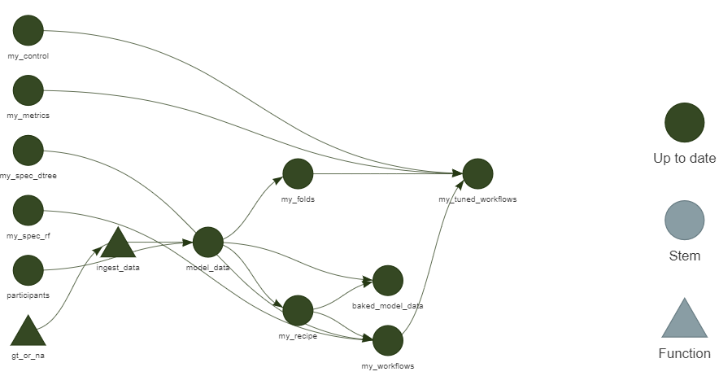
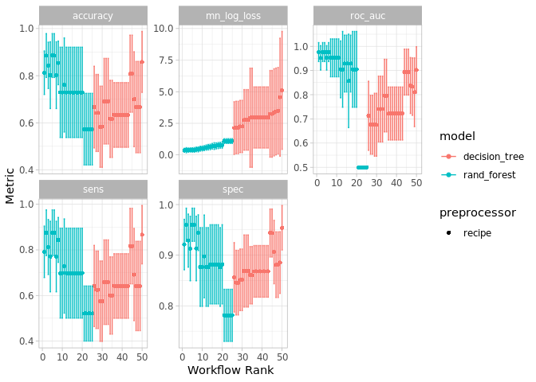

<!-- README.md is generated from README.Rmd. Please edit that file -->

# emdash.rules

<!-- badges: start -->
<!-- badges: end -->

The goal of emdash.rules is to …

## Installation

You can install the released version of emdash.rules from
[CRAN](https://CRAN.R-project.org) with:

``` r
install.packages("emdash.rules")
```

And the development version from [GitHub](https://github.com/) with:

``` r
# install.packages("devtools")
devtools::install_github("asiripanich/emdash.rules")
```

## Fit models using a Targets workflow

``` r
library(targets)
library(tidymodels)
```

``` r
tar_make()
#> -\|✔ skip target my_control
#> /✔ skip target my_spec_dtree
#> -✔ skip target my_spec_rf
#> \✔ skip target participants
#> |✔ skip target my_metrics
#> /✔ skip target model_data
#> -✔ skip target my_recipe
#> \✔ skip target my_folds
#> |✔ skip target baked_model_data
#> /✔ skip target my_workflows
#> -✔ skip target my_tuned_workflows
#> \✔ skip pipeline
#> |Warning message:
#> In readLines(script) : incomplete final line found on '_targets.R'
#> /- 
tar_load(my_tuned_workflows)
tar_load(baked_model_data)
```



``` r
head(baked_model_data)
#> # A tibble: 6 x 7
#>   android_i_os version_major version_minor version_patch last_communication_elapsed_time last_data_upload_elapsed_time status     
#>   <fct>        <fct>         <fct>         <fct>                                   <dbl>                         <dbl> <fct>      
#> 1 unknown      unknown       unknown       unknown                                -1                            -1     check token
#> 2 android      10            0             0                                       0.716                         0.882 unknown    
#> 3 ios          14            3             0                                       0.826                         0.874 unknown    
#> 4 android      7             1             1                                       0.733                         0.899 unknown    
#> 5 unknown      unknown       unknown       unknown                                -1                            -1     check token
#> 6 unknown      unknown       unknown       unknown                                -1                            -1     check token
autoplot(my_tuned_workflows) + theme_light(base_family = "IBMPlexSans")
```


